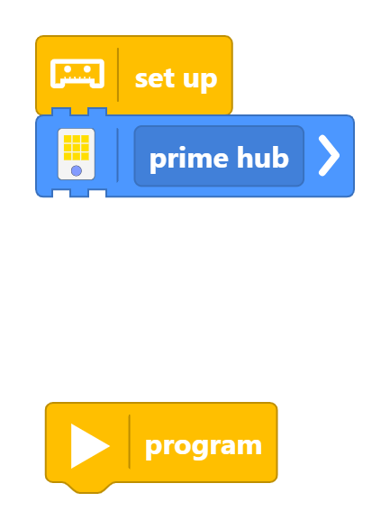

import { Meta } from "@storybook/addon-docs/blocks";

<Meta title="1. Fundamentals of Programming/1.2 Data Types & Operations/1.2.1 Variables" />

# 1.2.1 Variables

This section covers variables in Python programming. Open a file in your editor and follow along!

## What Are Variables?

Variables are like labeled boxes that store information for you to use later. You can put different types of data in these boxes, such as numbers, text, or more complex things.

Do you remeber how we added the prime hub block to the setup? That block has a input field which you can fill with a name. The default name is `prime hub`, but you can change it to anything you want.

This actually allready is a variable! The variable named `prime hub` stores a special kind of thing called an "object" that represents your LEGO Prime Hub.

We can use the name of our hub later in our code to tell the program to do something with that specific hub.

You might have guessed it already, the `set up` block is where we define our variables for our entire program.

### Creating Variables?

Now you might be wondering, but how do I create my own variables? For this there is a red labeled `Variable` section in left side bar of the Pybricks Code Editor. It has a suitcase as a icon.
